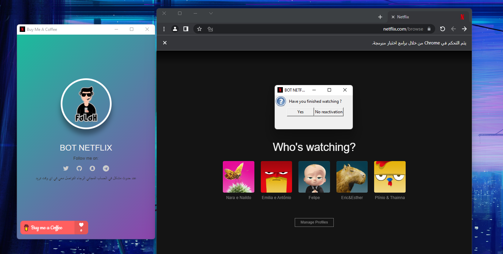

# 💰 BOT Netflix &middot; 
It is a bot to log into a shared Netflix account with your friends and family for _'free'_
+ **support:** Add the file to your computer, make sure Python3 is installed
+ **install libraries:** pip3 install -r requirements.txt
+ **Support the project:** Your support allows us to continue the free broadcasting accounts for everyone

<p align="center">
    
</p>

## [Installation:](assets/screenshot-5.mp4)
```bash
    $ git clone https://github.com/0xfff0800/Bot-Netflix.git
    $ cd Bot-Netflix
    $ pip3 install -r requirements.txt
    $ python3 main.py
```

## Todo
- [x] View from any file
- [x] Login without sharing a password and email
- [ ] share passwords
- [ ] private subscription
- [ ] Mobile device support


## Try it here!
It is still in beta and can stop working/lose data without warning, but you can try the bot until further notice

try: [http://t.me/flaah999](http://t.me/flaah999) 
